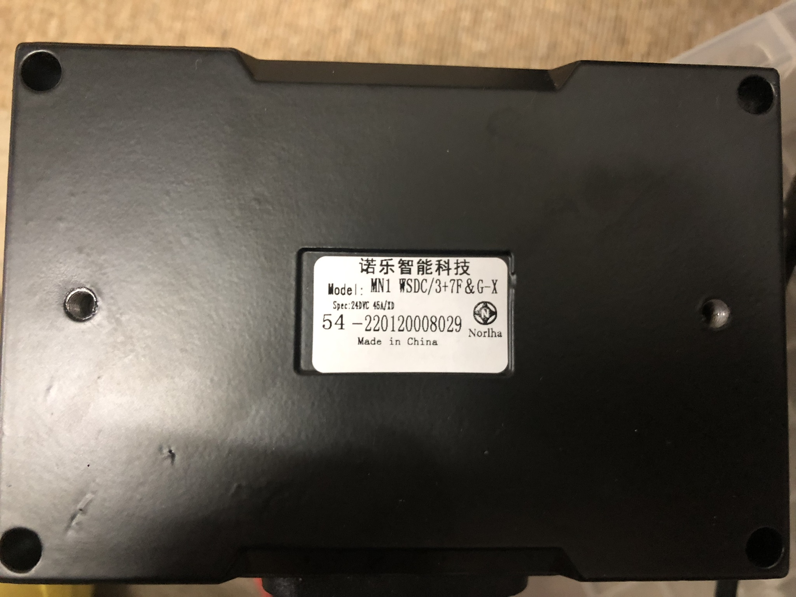
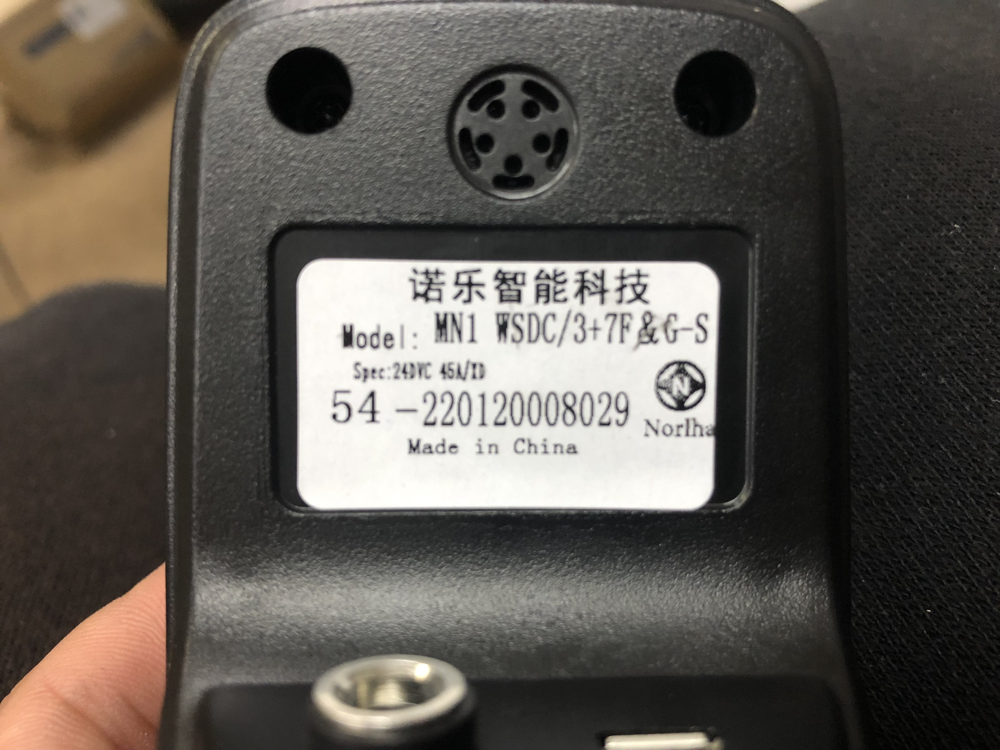

# BrushlessDriveWheels

This project is to hack a brushless drive wheels unit. The wheels, ESC and controller are sold in the set for wheelchair-like UGV, so user can control the speed and direction of the vehicle by using the controller or joystick that comes with. The supplier from China doesn't provide a detail to modify the controller, but in our application, we focus on an unmanned ground vehicle with autonomuos drive, so our goal for this project is to hack the communication between the ESC and the joystick, then pass our own command from other input (e.g. Arduino, Pi, or RC transmitter).

The tested UGV is look like this image below

Normally, a general wiring of this unit is as shown here...

## Hack New Batch ESC

For some reason, the ESC supplier has changed something on their ESC and joystick on a new batch.

From hacking, similar with old batch method, we observed some changes as listed below

- `InitHeader2` [here](https://github.com/rasheeddo/BrushlessDriveWheels/blob/bea20d1990cd79e848a73c00882172d46d84145d/BrushlessWheels.cpp#L14) got changed from 0x11 to 0x12

- New extra byte on handshake step [here](https://github.com/rasheeddo/BrushlessDriveWheels/blob/bea20d1990cd79e848a73c00882172d46d84145d/BrushlessWheels.cpp#L29).

- `InitCheckSum` has to include that new extra byte as [here](https://github.com/rasheeddo/BrushlessDriveWheels/blob/bea20d1990cd79e848a73c00882172d46d84145d/BrushlessWheels.cpp#L30).

- [delay](https://github.com/rasheeddo/BrushlessDriveWheels/blob/bea20d1990cd79e848a73c00882172d46d84145d/BrushlessWheels.cpp#L52) after waitUntilFourZero function.

- First two handshake is continously without [delay](https://github.com/rasheeddo/BrushlessDriveWheels/blob/bea20d1990cd79e848a73c00882172d46d84145d/BrushlessWheels.cpp#L158), and other 18 handshake later has different [delay](https://github.com/rasheeddo/BrushlessDriveWheels/blob/bea20d1990cd79e848a73c00882172d46d84145d/BrushlessWheels.cpp#L160).

- forward RPM mapping [range](https://github.com/rasheeddo/BrushlessDriveWheels/blob/bea20d1990cd79e848a73c00882172d46d84145d/BrushlessWheels.cpp#L80) got changed.

- reverse RPM mapping [range](https://github.com/rasheeddo/BrushlessDriveWheels/blob/bea20d1990cd79e848a73c00882172d46d84145d/BrushlessWheels.cpp#L85) got changed.

- For myself, I added some safety RPM limit [check](https://github.com/rasheeddo/BrushlessDriveWheels/blob/bea20d1990cd79e848a73c00882172d46d84145d/BrushlessWheels.cpp#L73) not to over the range.

## Data ranges 

To observe the real RPM which corresponding to the correct data bytes, I made this [example](https://github.com/rasheeddo/BrushlessDriveWheels/blob/new-batch-esc/examples/DriveByBytes/DriveByBytes.ino) where you can just input the HI_BYTE and LO_BYTE commands directly without RPM mapping function. 

### Forward

So I found that 0x64,0x00 (25600 DEC) can output 136 RPM on the motor (measured by tachometer), anything beyond 25600 would not make the motor spin any faster.

### Reverse

Maximum reverse RPM could go a bit more than 136 RPM (137-138RPM), but I would like to limit it at the same as forward, so the bytes are 0xE2, 0x90 (58000). The start of reverse is 0x82,0xDC (33500) which means there is no movement on the wheel yet, but if you give 33550 then it would start to spin very very slow at reverse.

